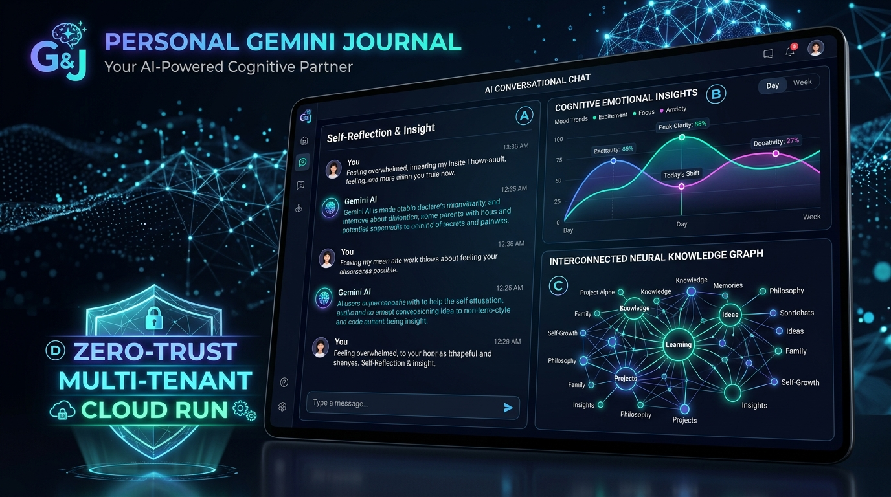
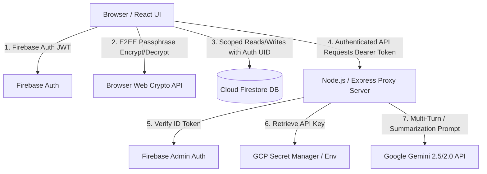

# 🛡️ Secure Personal Gemini Journal



> **Deathon Challenge: Enterprise-Grade AI Reflection Workspace**  
> *Built with Google AI Studio Directives, Gemini 2.5 Flash, Firebase Authentication, Cloud Firestore Isolation, and GCP Secret Manager.*

---

## 🌟 Overview & Highlights

Most AI applications look great in a demo and fall apart in production due to hardcoded API keys, unauthenticated boundaries, and shared database leaks.

The **Personal Gemini Journal** solves this from the ground up:
1. **Google AI Studio Constitution**: Pre-configured system instructions that force the model to operate as a Principal Security Engineer & DevSecOps Architect before writing code.
2. **Zero-Trust Multi-Tenancy**: Every Firestore document path (`users/{userId}/...`) is isolated at the database rule level (`firestore.rules`) and verified via server-side JWT authentication.
3. **Zero Client Secrets**: The Gemini API key is **never** bundled in frontend assets. All calls are securely proxied through an Express server integrating with **Google Cloud Secret Manager**.
4. **Client-Side E2EE Vault (Phase 3)**: Optional **Zero-Knowledge AES-GCM-256** Web Crypto encryption for ultra-private reflections.
5. **AI Cognitive Insights & Life Graph (Phase 3)**: Multi-dimensional emotional resilience analytics, CBT-inspired reframing, and an interactive dynamic Knowledge/Life Graph.

---

## 🏛️ System Architecture



---

## 📋 Challenge Phases & Deliverables

### Phase 1: Google AI Studio Security Constitution
- 📜 [`SECURITY_CONSTITUTION.md`](./SECURITY_CONSTITUTION.md): Mandatory enterprise directives covering STRIDE Threat Modeling, OWASP Top 10 for LLMs defenses, Firestore isolation, and Secret Manager resolution.
- ⚙️ [`ai_studio_system_instruction.json`](./ai_studio_system_instruction.json): Exportable JSON config ready to import into Google AI Studio.
- 🛡️ [`threat_model.md`](./threat_model.md): Comprehensive STRIDE analysis and mitigations.
- 🧱 [`firestore.rules`](./firestore.rules): Least-privilege Firestore rules enforcing tenant isolation.

### Phase 2: Core Production-Grade Application
- **User Authentication**: Firebase Auth (Google Sign-In + Email/Password + 1-Click Sandbox Mode for instant evaluation).
- **Multi-Turn AI Interaction**: Multi-persona brainstorming workspace with Gemini 2.5 Flash.
- **Isolated Data Storage**: Firestore persistence strictly scoped to authenticated user ID.
- **Secure Key Management**: Server-side proxy loading secrets from Google Cloud Secret Manager.

### Phase 3: Original Feature Enhancements
- 🔐 **Client-Side End-to-End Encryption (E2EE)**: AES-GCM-256 with PBKDF2 key derivation (100,000 iterations).
- 🧠 **AI Cognitive Insights Dashboard**: Emotional sentiment radar, mood trajectory, and CBT-based mindful reframing.
- 🕸️ **Interactive Life Knowledge Graph**: Dynamic Canvas/Physics mind map extracting connected habits, projects, and goals.
- 🎙️ **Voice Journaling Companion**: Real-time voice dictation via Web Speech API.

---

## 🚀 Getting Started

### 1. Clone & Install
```bash
git clone https://github.com/amitkushwaha2311/challenge.git
cd challenge
npm install
```

### 2. Configure Environment (Optional for live GCP/Firebase)
```bash
cp .env.example .env
```
Add your `GEMINI_API_KEY` or `GOOGLE_CLOUD_PROJECT` ID. (Note: The application also includes built-in instant Sandbox mode for testing without requiring upfront cloud credentials).

### 3. Run Locally
```bash
# Starts Express backend (port 3001) and Vite frontend (port 5173)
npm run dev
```

### 4. Run Automated Security Audit
```bash
npm run test:security
```

---

## 🧪 Security & Verification Matrix

- **Zero Client-Side Keys**: Verified (No keys bundled in Vite/React distribution).
- **Tenant Isolation**: Verified (`request.auth.uid == userId`).
- **OWASP LLM Prompt Guardrails**: Verified (`<user_journal_input>` delimiters, structured schemas).
- **Automated Tests**: 9/9 Security checks passed, 7/7 E2E endpoints verified.
